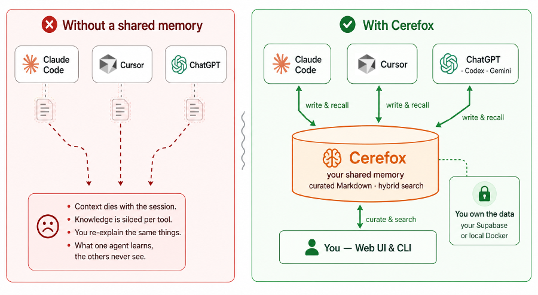
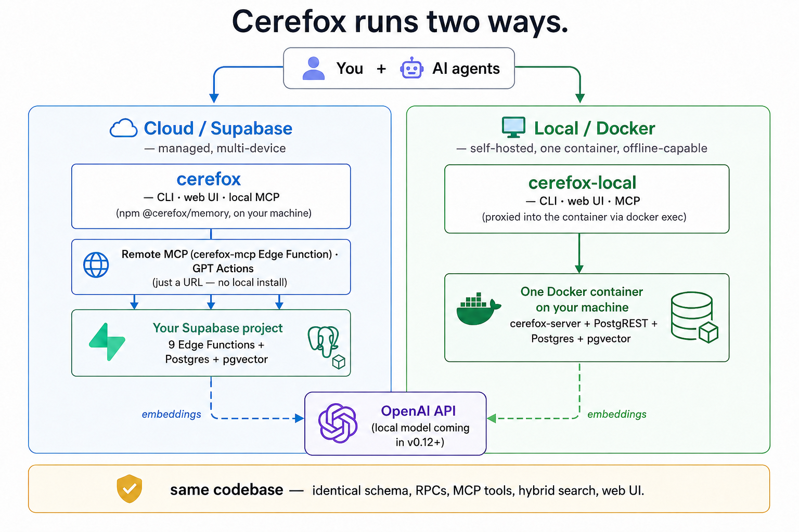

<p align="center">
  
</p>

# Cerefox

**User-owned shared memory for AI agents.** A persistent, curated knowledge layer that multiple AI tools can read and write, backed by Postgres + pgvector.

[](LICENSE)
[](https://nodejs.org)
[](https://discord.gg/5dnBVeqs9c)

---

## What is Cerefox?

<p align="center">
  
</p>

Cerefox is a **user-owned knowledge memory layer**: a persistent, curated knowledge base that sits between you and the AI tools you use.

The primary use case is **shared memory across AI agents**: knowledge written by one tool (Claude, ChatGPT, Cursor, or a custom agent) becomes immediately available to all others. This prevents context fragmentation, so the same information doesn't have to be re-explained in every session.

Cerefox is **asynchronous shared memory, not a message bus**. It solves the persistent context problem: knowledge written in one context is findable in any other. A user curates project documents and an AI agent discovers them through search without being told they exist. An agent writes a decision during a coding session and a different agent, on a different machine, running a different model, finds it days later. A user switches from one AI tool to another and the accumulated knowledge carries over without manual transfer. The boundaries that Cerefox dissolves are between agents, between sessions, between human and machine, and across time.

> For the full project vision, principles, and roadmap direction, see [`docs/research/vision.md`](docs/research/vision.md).

- **Agent-first, not human-first**: AI agents are first-class citizens on both sides: they read *and* write; humans curate and validate
- **Own your data**: everything lives in a Postgres database you control (Supabase free tier or self-hosted)
- **Cross-agent coordination**: agents on separate machines and runtimes coordinate through persistent shared context (see `docs/guides/agent-coordination.md`)
- **Not a note-taking app**: Cerefox is knowledge *infrastructure*, not a replacement for Obsidian, Notion, or Bear; those tools handle authoring, Cerefox handles indexing and agent access
- **Hybrid search**: full-text + semantic search finds relevant knowledge even with fuzzy or conceptual queries
- **Any agent, anywhere**: remote MCP via Supabase Edge Functions; ChatGPT via Custom GPT + GPT Actions
- **Keep it cheap**: Supabase free tier + low-cost cloud embeddings; see `docs/guides/operational-cost.md`

### Example use cases

Cerefox isn't bound to one tool or one workflow — anything that can run a shell command or speak MCP can read and write your memory, pointed at either a shared **cloud** deployment or a private **local** one:

<p align="center">
  
</p>

See [Connecting AI agents](#connecting-ai-agents) for the how-to per client.

---

## Community

Questions, ideas, or want to follow development? **[Join the Cerefox Discord](https://discord.gg/5dnBVeqs9c)** — setup & usage help for Cerefox and cf², release news, and a place to share what you're building.

---

## Features

| Feature | Details |
|---------|---------|
| **Hybrid search** | Combines full-text (BM25) + semantic (vector) search with a configurable alpha weight |
| **Metadata-filtered search** | JSONB containment filter (`@>`) on document metadata; server-side, GIN-indexed; composable with project filter and all search modes; available across all access paths (MCP, CLI, web UI, GPT Actions) |
| **Metadata search** | Standalone metadata-only search (no text query needed); find documents by key-value criteria, project, and date range; optional content inclusion with byte budget; dedicated MCP tool, CLI command, and web UI page |
| **Project discovery** | `cerefox_list_projects` MCP tool for agents to discover available projects; all search results include human-readable `project_names` alongside UUIDs |
| **Heading-aware chunking** | Greedy section accumulation — H1/H2/H3 sections accumulate until MAX_CHUNK_CHARS; heading breadcrumb preserved per chunk |
| **Cloud embeddings** | OpenAI `text-embedding-3-small` (768-dim) via API (the only embedder wired in the TS runtime today) |
| **Remote MCP endpoint** | `cerefox-mcp` Supabase Edge Function — MCP Streamable HTTP; connect Claude Desktop, Claude Code, or Cursor with just a URL and a Cerefox access token (`cerefox token generate`); no Python install needed |
| **Local MCP server** | `cerefox mcp` stdio server (TypeScript, from `@cerefox/memory`) -- local alternative with zero Edge Function usage, lower latency, and offline support; `npm install -g @cerefox/memory`. (A frozen Python MCP server also ships for repo-clone users: `uv run cerefox mcp`.) |
| **Web UI** | React + TypeScript SPA (Mantine UI) at `/app/`; Hono (TypeScript) JSON API backend served by `cerefox web`; Markdown viewer, search with 4 modes, document editing, project management |
| **Markdown-first ingest** | `.md` / `.txt` / `.docx` (Markdown is the storage format; `.docx` is converted via `mammoth` on ingest, fidelity varies. PDF is not supported — convert upstream) |
| **Batch ingest** | `cerefox document ingest-dir` recurses directories |
| **Deduplication** | SHA-256 content hash; re-ingesting the same file is a no-op |
| **Concurrency-safe updates** | Optimistic locking on content updates (v0.11+): writers pass the `content_hash` they read; a concurrent change fails with a conflict (re-read → merge → retry) instead of silently overwriting another agent's work. Explicit `last_write_wins` opt-out for file re-sync flows |
| **Backup and restore** | JSON snapshots, optional git commit |
| **Small-to-big retrieval** | `cerefox_context_expand` RPC returns chunk neighbours for richer context |
| **Audit log** | Immutable, append-only log of all write operations (create, update, delete, status change). Author attribution with `author_type` ('user' or 'agent'). Browsable via web UI, queryable via MCP tool and Edge Function |
| **Review status** | Schema-level `review_status` on documents (`approved` / `pending_review`). Auto-transitions based on author_type. Filterable on search |
| **Version governance** | Version archival (protect specific versions from cleanup), configurable retention (`CEREFOX_VERSION_CLEANUP_ENABLED`), version diff viewer |
| **Usage tracking** | Opt-in logging of all operations (reads and writes) across all access paths. Tracks operation type, access path (remote-mcp, local-mcp, edge-function, webapp, cli), requestor identity, query text, and result count. Controlled via `cerefox config set usage_tracking_enabled true/false` -- no redeploy needed |
| **Analytics dashboard** | `/app/analytics` -- 8 interactive charts: calls per day, access path breakdown, top documents, top readers, operations donut, requestor word cloud, requestor→document access patterns (HEB), and requestor→operation patterns (HEB). Date range + project + path filters. CSV export. |

---

## Project status

As of **v0.10.0** Cerefox runs two ways: against a hosted **Supabase** project,
or **fully local / self-hosted** in a single Docker container (no cloud, no
account). The whole runtime — CLI, MCP server, web UI, ingestion, and
server-side deploy — ships in the
[`@cerefox/memory`](https://www.npmjs.com/package/@cerefox/memory) npm package
(no repo clone); the local backend bundles that same runtime plus Postgres +
pgvector into one image.

Until **v1.0.0** the SemVer policy in [`CONTRIBUTING.md`](CONTRIBUTING.md) is
aspirational — breaking changes can land in minor versions when there's a good
reason; after v1.0.0 it's binding. Full release history is in
[`CHANGELOG.md`](CHANGELOG.md); the roadmap and iteration log live in
[`docs/plan.md`](docs/plan.md).

---

## Getting Started

> **Upgrading to v0.9?** The CLI verbs were renamed to a resource-verb shape
> (`cerefox get-doc X` → `cerefox document get X`; old names still run but
> redirect) and the Python CLI/web were retired to husks. See
> [`docs/guides/upgrading.md`](docs/guides/upgrading.md).

Cerefox runs **two ways — pick your backend.** Both expose the same features,
web UI, and MCP tools; they differ only in where your data lives and how you
install. (Contributors who want to run from source: see *Run from source* below.)

<p align="center">
  
</p>

### Option 1 — Cloud (Supabase)

Your data lives in **your own Supabase project** (free tier is enough). You use
the `cerefox` command from the [`@cerefox/memory`](https://www.npmjs.com/package/@cerefox/memory)
npm package. **No `git clone`, no Python, no build.**

```bash
# 1. Install (one-liner; detects Bun, falls back to npm):
curl -fsSL https://github.com/fstamatelopoulos/cerefox/releases/latest/download/install.sh | sh
#    or: npm install -g @cerefox/memory     (Node ≥ 20)

# 2. Configure + stand up the server side (against your own Supabase project):
cerefox init             # interactive setup: Supabase URL/keys, embedding key
cerefox server deploy    # schema + RPCs + all 9 Edge Functions, from the npm bundle
cerefox token generate   # mint the Edge Function access token; sets it on Supabase
                         # and writes CEREFOX_ACCESS_TOKEN to your .env. Needed for
                         # GPT Actions / remote MCP + a fully-green doctor; the local
                         # MCP, cloud Claude (OAuth) and CLI/web don't use it.
cerefox doctor           # verify everything is wired up

# 3. Wire up your AI agent(s) — run the ones that apply:
cerefox configure-agent --tool claude-code      # local MCP (preferred) — also: claude-desktop | cursor | codex | gemini
#   Cloud Claude (claude.ai/app): connect over OAuth (setup-supabase Step 7).
#   Custom GPT (ChatGPT): paste the token from step 2 into the Action's
#   Authentication → API Key (Bearer). See docs/guides/connect-agents.md.

# 4. Use it:
cerefox document ingest my-notes.md --title "My notes"
cerefox search "what did I decide about auth?"
cerefox web              # web UI → http://localhost:8000/app/
```

**Prerequisites:** Node 20+ or Bun 1.0+ · a Supabase account (free tier) · an
embedding API key (OpenAI `text-embedding-3-small`).

> **Full walkthrough:** [`docs/guides/quickstart.md`](docs/guides/quickstart.md)
> (~15 min). Supabase specifics: [`docs/guides/setup-supabase.md`](docs/guides/setup-supabase.md).

### Option 2 — Local / self-hosted (Docker)

Everything runs in **one Docker container** on your machine — Postgres + pgvector
+ the Cerefox server. **No Supabase account, no Node/Bun on the host**, just
Docker. You get a `cerefox-local` command (same KB verbs as `cerefox`).

```bash
# 1. Install (one-liner; pulls the all-in-one image, adds a `cerefox-local` command):
curl -fsSL https://github.com/fstamatelopoulos/cerefox/releases/latest/download/install-local.sh | sh

# 2. Set your OpenAI key (for embeddings) + wire up an AI agent:
cerefox-local init                 # set/rotate the OpenAI key (re-creates the container)
cerefox-local configure-agent      # wire an MCP client (e.g. Claude Code)

# 3. Use it:
cerefox-local document ingest my-notes.md --title "My notes"
cerefox-local search "what did I decide about auth?"
#    web UI → http://localhost:8000/app/  (or the port the installer chose — it auto-steps
#    to 8010/… if 8000 is busy; `cerefox-local status` shows the URL. Manage: status | upgrade | stop)
```

**Prerequisites:** Docker (Docker Desktop or [Colima](https://github.com/abiosoft/colima))
· an OpenAI API key (embeddings still use the OpenAI API).

> **Full walkthrough:** [`docs/guides/setup-local.md`](docs/guides/setup-local.md).
> Cloud and local are independent — different installer, different command name —
> so they never collide if you happen to run both.

### Run from source (contributors)

Clone the repo and run from source. `bun` drives everything; `uv` is only for
the legacy Python MCP fallback.

```bash
git clone https://github.com/fstamatelopoulos/cerefox.git && cd cerefox
bun install                  # workspace deps: root + packages/memory + frontend
uv sync                      # OPTIONAL — only for the legacy `uv run cerefox mcp` fallback
cp .env.example .env         # fill in Supabase URL/keys + embedding key

bun scripts/db_deploy.ts     # schema + RPCs  (--dry-run to preview · --reset to wipe first)
npx supabase functions deploy   # Edge Functions (or just use `cerefox server deploy`)

cd frontend && bun run build && cd ..   # build the SPA `cerefox web` serves at /app/
bun test                     # run the suite (root + packages/memory + _shared)
```

Full contributor setup, conventions, and the test matrix are in
[`CONTRIBUTING.md`](CONTRIBUTING.md) and the contributor section of
[`docs/guides/quickstart.md`](docs/guides/quickstart.md).

> **Python is legacy.** As of v0.9 the entire runtime (CLI, MCP, web,
> ingestion) is TypeScript in `@cerefox/memory`. The only surviving Python is
> `uv run cerefox mcp` — a frozen, offline / no-npm MCP fallback for repo-clone
> users. It is unmaintained and slated for removal; everything else Python is a
> husk that redirects to the TS CLI. See
> [`docs/guides/upgrading.md`](docs/guides/upgrading.md).

---

## Architecture

```
cerefox_documents     cerefox_chunks
─────────────────     ───────────────────────────────
id, title, source     id, document_id, chunk_index
content_hash          heading_path, heading_level
project_id            content, char_count
metadata (JSONB)      embedding_primary (VECTOR 768)
chunk_count           fts (TSVECTOR, title-boosted)
```

Search RPCs (MCP tools): `cerefox_hybrid_search`, `cerefox_fts_search`,
`cerefox_semantic_search`, `cerefox_search_docs`, `cerefox_reconstruct_doc`,
`cerefox_context_expand`, `cerefox_save_note`

---

## Connecting AI agents

The fastest path is `cerefox configure-agent --tool <client>` — it writes the
right config for Claude Code, Claude Desktop, Cursor, Codex, or Gemini. There
are several ways an agent can reach Cerefox:

**1 — Local stdio MCP (recommended for local agents).** `cerefox mcp` runs the
same 10 tools in-process — lower latency, no per-call Edge Function billing, and
no Edge Function token needed (it reaches Supabase over the Data API with its own
`.env` credential). `configure-agent` wires it up, or point your client at
`command: "cerefox", args: ["mcp"]`.

**2 — Remote HTTP MCP (advanced/fallback).** The `cerefox-mcp` Edge Function
speaks MCP Streamable HTTP. Just a URL + a Cerefox access token
(`cerefox token generate` — see
[setup-supabase.md](docs/guides/setup-supabase.md)). No local install:

```bash
claude mcp add --transport http cerefox \
  https://<project-ref>.supabase.co/functions/v1/cerefox-mcp \
  --header "Authorization: Bearer <cerefox-access-token>"
```

**3 — ChatGPT.** Custom GPT + GPT Actions pointing at the Edge Functions
(requires ChatGPT Plus). Paste the OpenAPI block from
[`connect-agents.md`](docs/guides/connect-agents.md) and set the Action's Bearer
auth to your Cerefox access token (`cerefox token generate`).

**4 — Shell CLI.** Local coding agents with a Bash tool (Claude Code, Codex,
opencode, …) can read and write Cerefox by running the installed `cerefox`
command directly — no MCP config at all. Point the agent at
[`AGENT_GUIDE.md`](AGENT_GUIDE.md) and let it use `cerefox search` /
`cerefox document ingest`.

**5 — Cloud & mobile Claude (optional).** claude.ai web and the Claude mobile
app connect to `cerefox-mcp` over **OAuth** — memory in your browser and on your
phone, with full hybrid search. It's an opt-in extra: it needs a one-time
Supabase OAuth setup plus a hosted consent page (the repo ships a one-command
[Cloudflare Worker](cloudflare/cerefox-consent/) for that, free). Nothing else
above requires it. See
[setup-supabase.md → Step 7](docs/guides/setup-supabase.md#step-7--oauth-for-cloud-agents-claudeai--mobile-optional).

Full setup for every client — plus a manual per-client config appendix for when
`configure-agent` can't reach a tool — is in
[`docs/guides/connect-agents.md`](docs/guides/connect-agents.md).

---

## Documentation

| Guide | Description |
|-------|-------------|
| [`docs/guides/quickstart.md`](docs/guides/quickstart.md) | Zero to first document in 15 minutes |
| [`docs/guides/setup-supabase.md`](docs/guides/setup-supabase.md) | Supabase project setup |
| [`docs/guides/configuration.md`](docs/guides/configuration.md) | All configuration options |
| [`docs/guides/connect-agents.md`](docs/guides/connect-agents.md) | MCP agent integration |
| [`docs/guides/cli.md`](docs/guides/cli.md) | Complete CLI reference (all `cerefox` subcommands) |
| [`docs/guides/agent-coordination.md`](docs/guides/agent-coordination.md) | Multi-agent coordination patterns and best practices |
| [`docs/guides/response-limits.md`](docs/guides/response-limits.md) | Response size limits: per-path behaviour and tuning |
| [`docs/guides/access-paths.md`](docs/guides/access-paths.md) | All access layers, credentials, and integration paths |
| [`docs/guides/setup-local.md`](docs/guides/setup-local.md) | Local / self-hosted (Docker) backend — install, `cerefox-local`, MCP |
| [`docs/guides/ops-scripts.md`](docs/guides/ops-scripts.md) | Backup, restore, migrate, sync docs |
| [`docs/guides/setup-cloud-run.md`](docs/guides/setup-cloud-run.md) | Google Cloud Run deployment |
| [`docs/guides/operational-cost.md`](docs/guides/operational-cost.md) | Cost breakdown for all deployment options |
| [`docs/guides/upgrading.md`](docs/guides/upgrading.md) | Upgrade checklist + notable cross-version transitions |
| [`AGENT_GUIDE.md`](AGENT_GUIDE.md) | Reference for AI agents using Cerefox tools |
| [`CONTRIBUTING.md`](CONTRIBUTING.md) | How to contribute to Cerefox |

---

## License

Apache 2.0 — see LICENSE.
