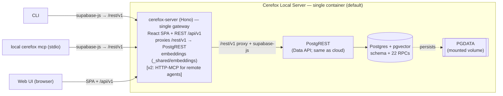

# Local / Self-Hosted Cerefox — Design & Plan

Status: **Draft / research** (2026-06-02). Author: design discussion + code audit.
Owner: Fotis. A future iteration (see `docs/plan.md`); this is the shaping doc a
later session executes from.

**Decision: D1 — ship PostgREST inside the container.** The local backend exposes
the *same Data API* (PostgREST) the cloud does, so the CLI, local MCP server, and
web app run **unchanged** — only the `.env` URL+key differ. No second
implementation, no new data-access code. (A pg-driver shim that drops PostgREST is
captured as a **future option** in §5.4, not planned.)

---

## 1. Motivation

Cerefox is cloud-first: multiple AI agents across machines share one remote memory
(Supabase + remote MCP), with local clients (MCP / CLI / web). That's the right
default, but there are real cases for a **fully local / self-hosted backend**:

- A developer on **one machine** (or a **LAN**) who wants memory without a cloud
  dependency.
- A **coding-agent harness** that wants persistent memory it controls.
- **Privacy / offline / air-gapped** users (no data leaves the box; eventually no
  external API at all — §6).
- Home-lab / **NAS** or **k8s** deployments.

This doc covers a **Postgres-based** local backend. A SQLite + sqlite-vec backend
stays a separate embeddable library for the strictly in-process case — it's
single-writer, unreliable over network filesystems, and would force a second
implementation of the SQL business logic. Out of scope here.

## 2. Goals / Non-goals

**Goals**
- A self-hostable backend = **Postgres + pgvector** + **PostgREST** + the existing
  **cerefox-server**, runnable as a **single container by default** (a 2-service
  split is available for power/k8s users), one command.
- **Reuse schema, RPCs, the data-access client (supabase-js), MCP tool handlers,
  web app, and React UI unchanged.** No business-logic re-implementation; no
  CLI/MCP fork.
- Works for: same-machine, LAN, NAS, k8s.
- Default embedder stays **OpenAI** (cloud API call); local embedder is a later
  opt-in (§6).

**Non-goals (for v1 of this feature)**
- Remote-agent HTTP-MCP into the local server (v2 of this feature — §5.3).
- Local embedding model (roadmap — §6).
- pg-driver shim / dropping PostgREST (future option — §5.4).
- SQLite backend (separate library).
- Auth/multi-tenant — single-user / single-trust-domain, same as cloud today.

## 3. Why this is tractable (key facts)

1. **All business logic lives in Postgres RPCs** (`SECURITY DEFINER` functions in
   `rpcs.sql`): hybrid search, ingest transaction, FTS title-weighting, version
   archival, small-to-big assembly, metadata search. They run on **any
   Postgres-with-pgvector**, unchanged.
2. **Embedding happens in the application layer, never in the RPCs.**
   `_shared/embeddings/` (`getEmbedding`/`embedBatch`) is called by the MCP handlers
   (`_shared/mcp-tools/{search,ingest}.ts`), the CLI, the web discovery route, and
   the ingestion pipeline. Local clients **already embed client-side** and pass a
   768-dim vector to the RPC.
3. **The whole stack already speaks PostgREST.** Every client uses `supabase-js`
   (`.rpc()`/`.from()`) → PostgREST. PostgREST is open source (you self-host the
   same component Supabase runs), so pointing `supabase-js` at a **local PostgREST**
   is a config change, not a code change.

> Consequence: a local backend = Postgres+pgvector + a local PostgREST + the
> existing server, with embeddings done client-side as today. **Edge Functions are
> not needed locally** (they only matter for *remote* HTTP agents — deferred, §5.3).

## 4. Audit — the data-access surface (sizing / risk)

Confirms the stack is portable and bounds any future shim. Grep across `_shared`,
`packages/memory/src`, `supabase/functions`:

- **22 RPCs** via `.rpc(name, params)` (e.g. `cerefox_hybrid_search`/`_fts_search`/
  `_search_docs`, `cerefox_ingest_document`, `cerefox_get_document`,
  `cerefox_metadata_search`, `cerefox_list_*`, `cerefox_*_config`,
  `cerefox_log_usage`).
- **5 tables** via `.from()`: `cerefox_documents`, `cerefox_chunks`,
  `cerefox_document_projects`, `cerefox_document_versions`, `cerefox_projects`.
- **Query-builder surface**: `select` (×80, incl. 4 `count:"exact", head:true`),
  `insert` (×20), `update` (×12), `delete` (×10), `eq` (×61), `is` (×15), `in` (×5),
  `not` (×2), `neq` (×1), `ilike` (×8), `like` (×2), `order` (×22), `limit` (×25),
  `range` (×2), `single` (×1), `maybeSingle` (×25).
- **No generic PostgREST `.filter(col,op,val)`** (the 37 `.filter(` hits are JS
  `Array.filter`); JSONB/metadata querying is **inside RPCs** (`cerefox_metadata_search`).
- **No auth / storage / realtime / `functions.invoke`** in CLI/web.
- **3 embedded foreign-table selects** only — `discovery.ts` (×2), `reindex.ts` (×1).
- A few **PostgREST error-code / count** dependencies (`42P01`, `42883`,
  `count:"exact", head:true`).

**Takeaways:** (a) for **D1** this all works **as-is** against a real PostgREST —
zero code. (b) The surface is small/standard enough that a future pg-driver shim
(§5.4) would be ~a few days, not a rewrite — useful to know, not needed now.

## 5. Architecture

### 5.1 Topology

Everything reaches the RPCs/tables through **PostgREST** — exactly as in the cloud,
just locally. The CLI and stdio MCP use `supabase-js` **unchanged**, pointed at the
**cerefox-server** URL, which proxies `/rest/v1` → PostgREST (the spike used a
standalone Caddy for this; the shipped server does it — §5.2/§5.6). The browser uses
`/api/v1` + the SPA as today. The dashed box is the default single-container
packaging (§5.5).

### 5.2 Why D1 (PostgREST in the container)

`supabase-js` is a PostgREST client; pointing it at a local PostgREST is config, not
code. So **CLI / MCP / web are byte-identical across cloud and local** — they read a
different `CEREFOX_SUPABASE_URL` + key from `.env`. This is the whole reason to ship
PostgREST: it makes the local backend a **drop-in** for the cloud Data API, with
**no fork and no maintained data-access code** (PostgREST is a stock OSS binary we
configure, not code we own).

Setup specifics (validated by the P0 spike — §5.6):
- **Gateway (`/rest/v1`) — new, LOCAL-ONLY code in cerefox-server.** supabase-js calls
  `/rest/v1/*`; PostgREST serves at root (Supabase bridges this with Kong). The shipped
  server mounts a `/rest/v1` → PostgREST **reverse-proxy route that is gated by config**
  (e.g. a `CEREFOX_POSTGREST_UPSTREAM` env, set only in the local image). Cloud
  deployments don't set it, so the route is **inert there** — it does not leak into or
  change cloud behavior. Result: one URL for clients, no separate Kong/Caddy. (The
  spike used a standalone Caddy as a stand-in.)
- **Auth — JWT ALWAYS required.** supabase-js always sends `Authorization: Bearer
  <key>`, so PostgREST needs `PGRST_JWT_SECRET` + a `{"role":"service_role"}` JWT as the
  key — **even on localhost** (anonymous/no-JWT does *not* work with a real supabase-js
  client). The **installer generates a per-install secret, injects it into the
  container, mints the service_role JWT, and writes it into the clients' env**
  (`CEREFOX_SUPABASE_KEY`); on reinstall it rotates the secret + re-writes the clients.
  Mirrors the cloud (the service key *is* a service_role JWT).
- **DB roles/grants:** create Supabase-like roles (`authenticator`/`anon`/
  `authenticated`/`service_role`); `service_role` = BYPASSRLS + full grants; clients use
  the `service_role` JWT. Roles must be created **before** PostgREST starts (it exits
  otherwise — §5.6).
- **First-boot deploy:** the entrypoint runs the existing `db_deploy.ts` (direct pg) +
  the roles SQL against the bundled Postgres before serving.

### 5.3 Clients & the agent path (v1 vs v2)

- **Web UI** — thin, unchanged: browser → `cerefox-server /api/v1` → PostgREST.
- **CLI / local stdio `cerefox mcp`** — thick, unchanged: `supabase-js` → local
  PostgREST. This is how **agents reach a local Cerefox in v1** (same stdio MCP they
  use today, pointed at the local Data API via config).
- **Remote/LAN agents over HTTP-MCP** — **v2 of this feature.** Mount the
  `cerefox-mcp` transport (same `_shared/mcp-tools` handlers, HTTP framing) in
  cerefox-server. Deferred deliberately ("build/test everything else first").

> Note: we do **not** make the CLI/MCP "thin" (calling the server's bespoke API) —
> reproducing the `.from()` query-builder over a custom REST API would mean
> re-implementing PostgREST *and* forking the clients. Thick-via-PostgREST keeps one
> implementation.

### 5.4 Future option (NOT planned): drop PostgREST via a pg-driver shim

A small client implementing the `MCPSupabaseClient` (`.rpc()`/`.from()`) interface
over a direct `pg` driver could remove the PostgREST process. The audit (§4) shows
this is bounded (~16 query methods, 22 RPC pass-throughs, 3 embedded selects to
refactor; ~a few days). It would sit **behind the same client interface**, so the
CLI/MCP/web command code would still **not fork**. Pursue **only** if PostgREST ever
becomes a real footprint/version-coupling burden (see §6-coupling). Default: keep
PostgREST.

### 5.5 Container shape — single all-in-one is the default

For the target user (one person, ~a dozen agents, local), **one all-in-one
container** is the default: Postgres + PostgREST + cerefox-server under a supervisor.
Simplest UX — one image, one `docker run`.

**Two hard requirements** (standard; they mitigate the only real risks):
- **PGDATA on a mounted named volume** — non-negotiable; replacing the image on
  upgrade then never touches data. Skipping it is the classic data-loss footgun.
- **A supervisor** (s6-overlay / supervisord) for start ordering (PostgREST + server
  wait for PG ready), crash-restart, and signal propagation.

**Residual tradeoffs — fine for an appliance:** an app update recreates the whole
container, so **Postgres bounces ~seconds** (the 2-service split avoids this); coupled
upgrades; intermixed logs; a Postgres **major** upgrade (pg16→17) needs
`pg_upgrade`/dump-restore (equally fiddly split — the image can carry the tooling).
*Download* size is mostly equal across shapes thanks to Docker **layer caching** — an
app-only update pulls only the changed top layer **if** the Dockerfile orders
base+Postgres+pgvector first and **app code last**.

**Dev/testing is unaffected by packaging:** we never develop inside the shipped
image — dev runs the app **from source** against a **standalone Postgres + PostgREST**
(compose); the all-in-one image is a **CI release artifact**.

**Alternative — 2-service split** (compose / k8s) for independent app updates:
`postgres` (official pgvector image) + an **app image bundling cerefox-server +
PostgREST** (both stateless app-tier). Recreating the app container leaves PG
running. Still one `docker compose up`; 2 pods in k8s. The app can also point at an
external/existing Postgres.

### 5.6 P0 spike — VALIDATED (2026-06-02)

Stood up Postgres+pgvector + pinned PostgREST (`v14.12`, matched to `postgrest-js`) +
a Caddy gateway via `docker/local/`; deployed schema/RPCs; pointed the **unmodified**
CLI + web at it. **Result:** `project create`/`list`, `document ingest` (768-dim OpenAI
embeddings), **hybrid search (pgvector)**, FTS search, and the web UI (`/app/`,
`/api/v1/{projects,dashboard,schema-version}`) all worked with **zero code change** —
only `CEREFOX_SUPABASE_URL`/key differed. Three findings, now folded into §5.2 + P1:

1. **Gateway needed** for `/rest/v1` → ship as a config-gated, local-only reverse-proxy
   route in cerefox-server (no separate component; inert in cloud).
2. **JWT always required** (supabase-js sends Bearer) → installer generates a
   per-install secret + mints a `service_role` JWT into the clients' env.
3. **Roles before PostgREST** — it exits if `authenticator` is missing at boot.

Runbook + working artifacts: `docker/local/` (compose, roles.sql, Caddyfile, README).

### 5.7 P1 image + P2 installer — VALIDATED (2026-06-02)

- **P1 all-in-one image** (`docker/local/Dockerfile` + `image-entrypoint.sh`): one
  `docker run` → working local Cerefox. Validated end-to-end: `/app/`, project CRUD,
  ingest (768-dim OpenAI embeddings), hybrid search — all in a single container, data
  in a named volume. MVP is shell-orchestrated; **s6-overlay supervision is the
  follow-up.** (Minor: `schema-version.bundled` reads null in the image — benign, no
  false banner; cosmetic cleanup.)
- **P2 installer** (`docker/local/install-local.sh`, "Model B"): generates a
  per-install secret (openssl — no bun/node needed), injects it (`-e
  PGRST_JWT_SECRET`), mints the matching `service_role` JWT, and writes a **separate**
  client config (`~/.cerefox/local/.env`) so local + cloud coexist — **cloud
  `~/.cerefox/.env` is never touched.** Validated: CLI against the local config
  connects (openssl JWT accepted). **Remaining:** ghcr.io publish, fold into the
  shared `install.sh` / `cerefox init`.

**JWT distribution (resolves the open question):** the **web UI never needs the JWT**
— the browser talks to cerefox-server, which holds the JWT server-side for its own
data calls. **CLI/MCP** clients *do* need it — that's the installer's job (Model B).
The image self-generates a secret only as the no-installer fallback (web-UI-only
appliance). Local clients use a separate `CEREFOX_CONFIG_DIR` so they never collide
with the cloud config.

## 6. Embeddings

- **v1 default: OpenAI** (`text-embedding-3-small`, 768-dim) via `_shared/embeddings`.
  Just needs `OPENAI_API_KEY` in the server env. No change.
- **Roadmap: local embedder** (opt-in). `getEmbedding`/`embedBatch` already sit
  behind a pluggable `Embedder` protocol; generalize `ctx.openaiApiKey` →
  `ctx.embedder`. A standalone transformers.js/ONNX embedder (no Ollama) yields a
  **fully offline, zero-external-call** Cerefox. Constraints to document:
  - Must output **768 dims** (schema is fixed at 768): `nomic-embed-text`,
    `bge-base-en`, `gte-base` qualify; MiniLM's 384 won't.
  - **Embeddings aren't interchangeable across models** — switching ⇒ full
    `cerefox server reindex`. Document loudly.
  - Originally dropped because the **remote-MCP path embeds inside Edge Functions,
    which can't host a local model** (so one model couldn't run both places).
    CLAUDE.md's "cloud-only embeddings" decision also cites platform-specific
    failures + install complexity. A **local-only** backend removes the EF
    constraint — which is what reopens the option.
  - On a NAS, local inference may be slow + RAM-tight; cloud embeddings (an API
    call, no local compute) may be the better default there. Per-deploy choice.

## 6-coupling. Version coupling: supabase-js ↔ PostgREST (important)

D1's strength (clients unchanged) creates one coupling to manage. `supabase-js`
(via `postgrest-js`) speaks a PostgREST protocol whose behavior can change across
PostgREST major versions (count syntax, embedding, error-JSON shape, etc.).

**The risk, stated precisely:** the trigger is **us bumping `supabase-js`** (a routine
dep update), *not* Supabase changing their platform. Supabase's managed cloud
PostgREST is always current, so a too-new `supabase-js` keeps working against the
cloud — which **masks** the break. Only the **local image's pinned PostgREST** would
fail. A local-only regression could thus ship while cloud CI stays green.

**Mitigations (must be in the implementation):**
1. **Pin the PostgREST image version explicitly** (never `latest`), recorded next to
   the shipped `supabase-js`/`postgrest-js` version.
2. **CI compat suite against the pinned local PostgREST** — run the existing
   read/write/MCP test suites against a local PostgREST container (not just cloud).
   This is the catch; without it, cloud masks the break.
3. **Treat a `supabase-js`/`postgrest-js` bump as a trigger** to run that suite and
   bump the pinned PostgREST if needed (Dependabot/Renovate PRs must run it) + a
   `RELEASING.md` checklist line.
4. **Extend the compatibility concept** (`_shared/compatibility` + `cerefox doctor`)
   so a client can detect/warn when the local server's PostgREST is outside its
   supported range — same pattern as the existing client↔schema/EF matrix.

## 7. Packaging & distribution

**Publish prebuilt images, not a local-assembly installer.** A published image is a
prebuilt, content-addressed artifact pulled from a registry (layer caching skips
unchanged layers) — not instructions that assemble components on the user's machine.
Local assembly is fragile, slow, toolchain-/platform-dependent.

Building blocks (give both deploy shapes without choosing):
- **app image** (`cerefox-server` + PostgREST, app-tier) — **multi-arch**
  (`linux/amd64` + `linux/arm64`, for Apple Silicon + NAS), built/pushed by CI on tag.
- **all-in-one image** — `FROM pgvector/pgvector:pg16` + PostgREST + server +
  s6-overlay (default; one `docker run`). App code as the **top layer**.
- **`docker-compose.yml`** — official `pgvector/pgvector` image + the app image (the
  app-only-update path).

> **Multi-arch is about the *image*, not bun compilation.** A container image bundles
> the (per-arch) Node/Bun runtime + native deps + Postgres/pgvector/PostgREST
> binaries, so it's OS+arch-specific. Containers are always Linux; on macOS they run
> via Docker Desktop's Linux VM. We `docker buildx` for amd64 + arm64 so one tag runs
> natively on Macs + NAS + x86 servers. The CLI/MCP npm package is plain JS on
> Node/Bun — already cross-platform, no per-OS binary.

The **installer is a thin wrapper**: check Docker → `docker run` the all-in-one (or
drop a compose file + `up`) → wire the **mounted volume**, `OPENAI_API_KEY`, port. It
**pulls prebuilt images; never builds.**

- **Registry: GitHub Container Registry (ghcr.io)** — free for public images, no
  pull-rate limits for public, same GitHub auth, slots into `release.yml`. Multi-arch
  via `docker buildx` in CI on tag.

## 8. Deployment targets / test plan

- **Dev laptop** + a **desktop workstation** — primary dev/test (the workstation can
  also exercise a local embedder later).
- A **low-RAM NAS** (e.g. 4 GB, RAID-6) — the resilience story. Postgres idle
  ~50–150 MB + a personal-KB pgvector index is small + PostgREST (~tens of MB) +
  light server ⇒ **4 GB is plenty** with cloud embeddings. RAID-6 `postgres_data`
  volume = durable. If dependable here, advertise + support it.
- **k8s** — Postgres statefulset + the app deployment, or the all-in-one.

## 9. Reuse map

| Component | Local backend (D1) |
|---|---|
| `rpcs.sql` (22 RPCs, all logic) | **reused 100%** |
| `schema.sql` + migrations | **reused 100%** (first-boot deploy via existing `db_deploy.ts`) |
| `supabase-js` data-access (CLI/MCP/web) | **unchanged** — config points at local PostgREST |
| `_shared/mcp-tools/*` (10 tools) | **reused 100%** |
| `_shared/embeddings/*` | **reused 100%** (local embedder slots behind it later) |
| Hono web app + `/api/v1` + React SPA | **reused 100%** |
| PostgREST | **stock OSS component** — configured, not maintained (pinned version) |
| Edge Functions (Deno) | **not used locally** (HTTP-MCP re-mounted in cerefox-server in v2) |
| `docker-compose.yml` | **exists but untested** — needs hardening (§10) |

## 10. Known gaps / risks

- **`docker-compose.yml` is untested** and predates the v0.9 Python husking (its
  `cerefox-web` service wires `CEREFOX_DATABASE_URL`, but the TS runtime uses
  supabase-js → PostgREST). The spike (P0) replaces/validates it.
- **Version coupling** (supabase-js ↔ pinned PostgREST) — see §6-coupling; the CI
  compat suite is the mitigation.
- **Security:** localhost-bound by default. Exposing on a LAN = an unauthenticated
  Data API (same single-key trust model as cloud) → require `PGRST_JWT_SECRET` + a
  token, and/or a reverse proxy. PostgREST DB role gets least-privilege grants.
- **Backend parity tax** — D1 minimizes it (one client implementation). Don't promote
  SQLite or the pg-shim to first-class without cause.

## 11. Decisions (resolved) + remaining questions

**Resolved:**
- **D1** (ship PostgREST), not a pg-shim. Clients unchanged.
- **Single all-in-one container** default; 2-service split available.
- **Thick** CLI/MCP (unchanged); **thin** web UI; **HTTP-MCP = v2**.
- **ghcr.io**, multi-arch prebuilt images.
- OpenAI embedder default; local embedder = roadmap.

**Remaining (resolve during build):**
1. Exact **pinned PostgREST version** matched to the shipped `postgrest-js`.
2. Localhost **anonymous** PostgREST vs always-JWT (lean anon for localhost, JWT for LAN).
3. Ship the 2-service split **day one**, or all-in-one first then add split?
4. `cerefox init` "local server" mode UX (writes server env-file + client URL).

## 12. Phased plan (this maps to the plan.md iteration)

- **P0 — spike: ✅ DONE (2026-06-02).** `docker/local/` (pgvector + pinned PostgREST
  `v14.12` + Caddy gateway); first-boot `db_deploy.ts` + roles; unmodified CLI + web
  validated end-to-end (ingest, hybrid/FTS search, web UI). Surfaced the 3 findings
  (§5.6) — corrected the earlier anon-localhost assumption to JWT-always + a gateway.
- **P1 — all-in-one image + hardening:** Dockerfile (`pgvector/pgvector:pg16` +
  PostgREST + cerefox-server + s6-overlay), mounted PGDATA volume; entrypoint creates
  **roles BEFORE PostgREST starts** (ordering, §5.6), runs first-boot deploy;
  healthchecks; `OPENAI_API_KEY` env. **New: cerefox-server `/rest/v1` reverse-proxy
  route → PostgREST, config-gated (local-only; inert in cloud — §5.2)** so a separate
  Caddy isn't needed. **Version-coupling CI suite** (read/write/MCP tests vs the pinned
  local PostgREST). Test on laptop/workstation/NAS.
- **P2 — distribution + installer:** multi-arch build + push to **ghcr.io** via
  `release.yml`; the 2-service split (compose); the **thin installer wrapper**. **New:
  installer JWT logic** — generate a per-install `PGRST_JWT_SECRET`, inject it into the
  container, mint a `service_role` JWT, and write it into the clients' env
  (`CEREFOX_SUPABASE_KEY`); rotate + re-write on reinstall. `cerefox init` local-server
  mode; user docs (`docs/guides/`).
- **P3 (roadmap) — local embedder:** transformers.js/ONNX (768-dim, e.g.
  `nomic-embed-text`), opt-in, reindex-on-change docs → fully offline.
- **Later (v2 of feature) — remote HTTP-MCP** in cerefox-server for LAN/remote agents.

---

*Note: a SQLite + sqlite-vec backend stays a separate embeddable library (see §1),
intentionally out of scope — it would require a second implementation of the SQL
business logic and is single-writer / single-machine.*
